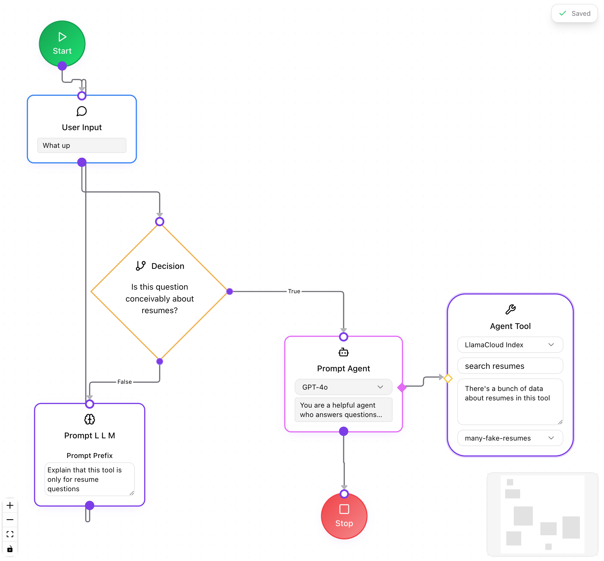

# Flow Maker, a visual agent builder for LlamaIndex

This is a tool for visually creating and exporting agentic workflows powered by LlamaIndex. It provides a drag-and-drop interface to build complex workflows, run them interactively, and then compile them into standalone TypeScript code.

It's open sourced under the MIT license, so you can run it locally and modify it to add features (there are a lot of obvious things to add!).



## ✨ Features

-   **Visual Editor**: Use a drag-and-drop canvas powered by `@xyflow/react` to design your agent's logic.
-   **Interactive Debugging**: Run your workflow directly in the browser to test and debug its behavior step-by-step.
-   **Code Generation**: Compile your visual workflow into standalone TypeScript code using `@llamaindex/workflow-core`.
-   **LLM Integration**: Supports multiple LLM providers like OpenAI, Anthropic, and Google.
-   **Tool Support**: Easily integrate tools into your agent to interact with external services.

### Existing tools

Currently the only tool implemented is a LlamaCloud index search tool, which requires a LlamaCloud API key.

## 🚀 Getting Started

Follow these steps to get the project running locally.

### Prerequisites

-   [Node.js](https://nodejs.org/en) (v18.0 or higher recommended)
-   `npm` or your preferred package manager

### Installation & Setup

1.  **Clone the repository:**
    ```sh
    git clone <YOUR_GIT_URL>
    cd llama-agent-creator
    ```

2.  **Install dependencies:**
    ```sh
    npm install
    ```

3.  **Run the development server:**
    ```sh
    npm run dev
    ```

## Running and debugging

Open [http://localhost:3000](http://localhost:3000) with your browser to see the result. If you access it in [debug mode](http://localhost:3000?debug=1), you'll get an extra "intermediate" compiler that shows you more about what's happening under the hood. This is very useful when trying to debug something that works in the compiled TypeScript but not the interactive Run View or vice versa.

## 🛠️ Tech Stack

-   **Framework**: [Next.js](https://nextjs.org/)
-   **Language**: [TypeScript](https://www.typescriptlang.org/)
-   **UI**: [React](https://react.dev/) & [shadcn/ui](https://ui.shadcn.com/)
-   **Graph UI**: [`@xyflow/react`](https://reactflow.dev/)
-   **Workflow Engine**: [`@llamaindex/workflow-core`](https://www.npmjs.com/package/@llamaindex/workflow-core)
-   **Styling**: [Tailwind CSS](https://tailwindcss.com/)

## Architecture Overview

The application has a dual-execution model:

1.  **Interactive Runner**: The UI in `src/components/RunView.tsx` executes the workflow step-by-step in the browser, making calls to backend API routes in `app/api/` for LLM and tool operations.
2.  **TypeScript Compiler**: The logic in `src/lib/typescript-compiler.ts` takes the same visual graph and generates a standalone Node.js script that can be run independently.

When modifying node behavior, ensure consistency by updating logic in both the corresponding API route and the TypeScript compiler. See ./cursor/rules for more information about how this works.
